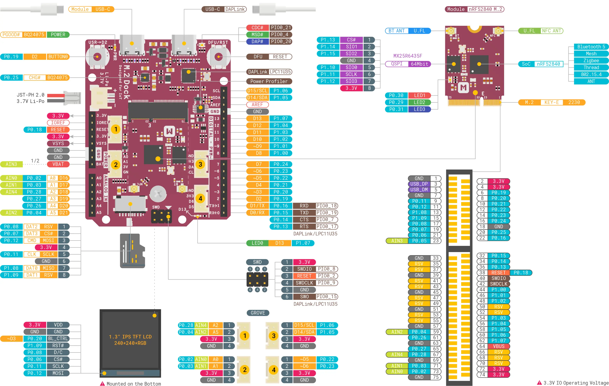

# nRF52840 M.2 Developer Kit
> An open-source developer kit based on nRF52840 M.2 module, designed for IoT prototyping

## Description
nRF52840 M.2 Developer Kit is a versatile IoT prototyping platform, including the [nRF52840 M.2 Module](https://wiki.makerdiary.com/nrf52840-m2) and [M.2 Dock](https://wiki.makerdiary.com/m2-dock). You can use the Dev Kit to prototype your IoT solutions and then scale to production using the nRF52840 M.2 Module combined with your custom PCB hardware in a short time.

The [nRF52840 M.2 Module](https://wiki.makerdiary.com/nrf52840-m2) is an M.2 E-Key form factor module for Bluetooth Low Energy, Bluetooth mesh, Thread, Zigbee, 802.15.4, ANT and 2.4 GHz proprietary applications on the nRF52840 SoC.

The [M.2 Dock](https://wiki.makerdiary.com/m2-dock) extends the interfaces compared to the nRF52840 M.2 Module through an M.2 E-Key connector. This design also features a fully-integrated [DAPLink](https://armmbed.github.io/DAPLink/) debugger with [Power Profiling](power-profiling.md), enabling you to program, debug and perform real-time current profiling of your IoT applications without using external tools.

## Key Features

* nRF52840 M.2 Module
	- Nordic Semiconductor nRF52840 SoC
	- 64 MHz Arm® Cortex-M4 with FPU, 1 MB Flash + 256 KB RAM
	- Bluetooth 5, Bluetooth mesh, Thread, Zigbee, 802.15.4, ANT and 2.4 GHz proprietary
	- Arm TrustZone® Cryptocell 310 Security Subsystem
	- M.2 Key-E with USB 2.0, UART, SPI, TWI, PDM, I2S, PWM, ADC and up to 33 GPIOs
	- User programmable RGB LED
	- Ultra low power 64Mbit QSPI flash memory
	- U.FL/I-PEX MHF Antenna Connectors

* Integrated DAPLink Debugger
	- MSC - drag-n-drop programming flash memory
	- CDC - virtual com port for log, trace and terminal emulation
	- HID/WEBUSB HID - CMSIS-DAP compliant debug channel

* Advanced Power Profiling
	- Up to 690 mA current measurement
	- Voltage tracking
	- 30000 samples per second
	- Precision amplifiers with dual gain stage
	- Cross-platform utility available in Python

* Shipped with Python Interpreter firmware
* 1.3" 240x240 Color IPS TFT LCD Display
* Li-Po Battery Charger with Power Path Management
* User programmable LED and Button
* 2.4 GHz and NFC cabled PCB Antennas
* microSD Card Slot
* Arduino Form Factor
* 4 Grove Connectors
* Reversible USB-C Connectors

## Hardware Diagram

The hardware diagram of the nRF52840 M.2 Developer Kit is shown below:

## Included in the Box
|    **Part**                | **Qty** |
| -------------------------- | ------- |
| nRF52840 M.2 Module        | 1       |
| M.2 Dock                   | 1       |
| 2.4 GHz Cabled PCB Antenna | 1       |
| NFC Cabled PCB Antenna     | 1       |
| USB-C Cable                | 1       |

## Tutorials
We think the best way to learn is by doing. And to help you get started, we have provided a series of tutorials. Find the details below:

* [nRF52840 M.2 Developer Kit Wiki](https://wiki.makerdiary.com/nrf52840-m2-devkit)
* [Getting Started with nRF52840 M.2 Developer Kit](https://wiki.makerdiary.com/nrf52840-m2-devkit/getting-started)
* [How to Program the nRF52840 M.2 Module](https://wiki.makerdiary.com/nrf52840-m2-devkit/programming)
* [Getting Started with Power Profiling](https://wiki.makerdiary.com/nrf52840-m2-devkit/power-profiling)
* [Python Tutorials](https://wiki.makerdiary.com/nrf52840-m2-devkit/python)
* [nRF5 SDK Tutorials](https://wiki.makerdiary.com/nrf52840-m2-devkit/nrf5-sdk)
* [Zephyr RTOS Tutorials](https://wiki.makerdiary.com/nrf52840-m2-devkit/zephyr)

## Design Resource
* [nRF52840 M.2 Developer Kit Hardware Diagram V1.0](docs/hw/nrf52840_m2_devkit_hw_diagram_v1_0.pdf)
* [nRF52840 M.2 Developer Kit 3D Model V1.0](hw/)
* [nRF52840 M.2 Module Documentation](https://wiki.makerdiary.com/nrf52840-m2)
* [M.2 Dock Documentation](https://wiki.makerdiary.com/m2-dock)

## Where to Buy

nRF52840 M.2 Developer Kit is available on the following channels (click to go directly to the product):

## Contributing

We would love for you to contribute to this project and help make it even better than it is today! See our [Contributing Guidelines](https://wiki.makerdiary.com/nrf52840-m2-devkit/CONTRIBUTING) for more information.

## MIT License

Copyright (c) 2020 [makerdiary](https://makerdiary.com)

Permission is hereby granted, free of charge, to any person obtaining a copy
of this software and associated documentation files (the "Software"), to deal
in the Software without restriction, including without limitation the rights
to use, copy, modify, merge, publish, distribute, sublicense, and/or sell
copies of the Software, and to permit persons to whom the Software is
furnished to do so, subject to the following conditions:

The above copyright notice and this permission notice shall be included in all
copies or substantial portions of the Software.

THE SOFTWARE IS PROVIDED "AS IS", WITHOUT WARRANTY OF ANY KIND, EXPRESS OR
IMPLIED, INCLUDING BUT NOT LIMITED TO THE WARRANTIES OF MERCHANTABILITY,
FITNESS FOR A PARTICULAR PURPOSE AND NONINFRINGEMENT. IN NO EVENT SHALL THE
AUTHORS OR COPYRIGHT HOLDERS BE LIABLE FOR ANY CLAIM, DAMAGES OR OTHER
LIABILITY, WHETHER IN AN ACTION OF CONTRACT, TORT OR OTHERWISE, ARISING FROM,
OUT OF OR IN CONNECTION WITH THE SOFTWARE OR THE USE OR OTHER DEALINGS IN THE
SOFTWARE.