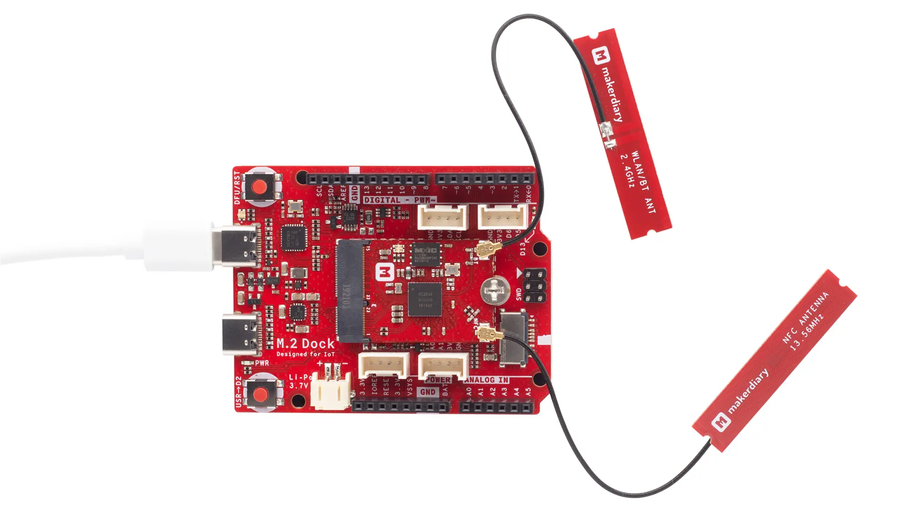

# nRF52840 M.2 Developer Kit <small>An open-source developer kit based on a removable nRF52840 M.2 module, designed for IoT prototyping</small>

## Description

**[nRF52840 M.2 Developer Kit](https://store.makerdiary.com/products/nrf52840-m2-developer-kit)** is a versatile IoT prototyping platform, including the [nRF52840 M.2 Module](https://store.makerdiary.com/products/nrf52840-m2-module) and [M.2 Dock](https://wiki.makerdiary.com/m2-dock). You can use the developer kit to prototype your IoT products and then scale to production faster using the nRF52840 M.2 Module combined with your custom PCB hardware.

The [nRF52840 M.2 Module](https://store.makerdiary.com/products/nrf52840-m2-module) is a removable M.2 E-Key form factor module based on the nRF52840 SoC, supporting Bluetooth 5, Bluetooth mesh, Thread, Zigbee, 802.15.4, ANT and 2.4 GHz proprietary stacks.

The [M.2 Dock](https://wiki.makerdiary.com/m2-dock) extends the interfaces compared to the nRF52840 M.2 Module through an M.2 E-Key connector. This design also features a fully-integrated [DAPLink](https://armmbed.github.io/DAPLink/) debugger with [Power Profiling](power-profiling.md), enabling you to program, debug and perform real-time current profiling of your IoT applications without using external tools.

## Key Features

* nRF52840 M.2 Module
	- Nordic Semiconductor nRF52840 SoC
	- 64 MHz Arm® Cortex-M4 with FPU, 1 MB Flash + 256 KB RAM
	- Bluetooth 5, Bluetooth mesh, Thread, Zigbee, 802.15.4, ANT and 2.4 GHz proprietary
	- Arm TrustZone® Cryptocell 310 Security Subsystem
	- M.2 Key-E with USB 2.0, UART, SPI, TWI, PDM, I2S, PWM, ADC and up to 33 GPIOs
	- User programmable RGB LED
	- Ultra low power 64Mbit QSPI flash memory
	- U.FL/I-PEX MHF Antenna Connectors

* Integrated DAPLink Debugger
	- MSC - drag-n-drop programming flash memory
	- CDC - virtual com port for log, trace and terminal emulation
	- HID/WEBUSB HID - CMSIS-DAP compliant debug channel

* Advanced Power Profiling
	- Up to 690 mA current measurement
	- Voltage tracking
	- 30000 samples per second
	- Precision amplifiers with dual gain stage
	- Cross-platform utility available in Python

* Shipped with Python Interpreter firmware
* 1.3" 240x240 Color IPS TFT LCD Display
* Li-Po Battery Charger with Power Path Management
* User programmable LED and Button
* 2.4 GHz and NFC cabled PCB Antennas
* microSD Card Slot
* Arduino Form Factor
* 4 Grove Connectors
* Reversible USB-C Connectors
* 3.3V IO Operating Voltage

## Hardware Diagram

The hardware diagram of the nRF52840 M.2 Developer Kit is shown below:

## Included in the Box
|    **Part**                | **Qty** |
| -------------------------- | ------- |
| nRF52840 M.2 Module        | 1       |
| M.2 Dock                   | 1       |
| 2.4 GHz Cabled PCB Antenna | 1       |
| NFC Cabled PCB Antenna     | 1       |
| USB-C Cable                | 1       |

## Tutorials
We think the best way to learn is by doing. And to help you get started, we have provided a series of tutorials. Find the details below:

* [Getting Started with the nRF52840 M.2 Developer Kit](getting-started.md)
* [How to Program the nRF52840 M.2 Module](programming.md)
* [Getting Started with Power Profiling](power-profiling.md)
* [Python Tutorials](python/index.md)
* [nRF5 SDK Tutorials](nrf5-sdk/index.md)
* [Zephyr OS Tutorials](zephyr/index.md)
* [nRF52840 M.2 Module Documentation](https://wiki.makerdiary.com/nrf52840-m2)
* [M.2 Dock Documentation](https://wiki.makerdiary.com/m2-dock)

## Design Resource

|    **Title**                | **Version** |
| --------------------------- | ----------- |
| [nRF52840 M.2 Developer Kit Hardware Diagram](https://wiki.makerdiary.com/nrf52840-m2-devkit/resources/nrf52840_m2_devkit_hw_diagram_v1_0.pdf) | V1.0 |
| [nRF52840 M.2 Module Hardware Diagram](https://wiki.makerdiary.com/nrf52840-m2/resources/nrf52840_m2_module_hw_diagram_v1_0.pdf) | V1.0 |
| [M.2 Dock Hardware Diagram](https://wiki.makerdiary.com/m2-dock/resources/m2_dock_hw_diagram_v1_0.pdf) | V1.0 |
| [nRF52840 M.2 Module Schematic](https://wiki.makerdiary.com/nrf52840-m2/resources/nrf52840_m2_module_schematic_v1_0.pdf) | V1.0 |
| [M.2 Dock Schematic for nRF52840 M.2 Module](https://wiki.makerdiary.com/m2-dock/resources/m2_dock_schematic_v1_0_for_nrf52840.pdf) | V1.0 |
| [nRF52840 M.2 Module Board File](https://wiki.makerdiary.com/nrf52840-m2/resources/nrf52840_m2_module_board_file_v1_0.pdf) | V1.0 |
| [M.2 Dock Board File V1.0](https://wiki.makerdiary.com/m2-dock/resources/m2_dock_board_file_v1_0.pdf) | V1.0 |
| [nRF52840 M.2 Developer Kit 3D Model](https://wiki.makerdiary.com/nrf52840-m2-devkit/resources/nrf52840_m2_devkit_3d_model_v1_0.step) | V1.0 |
| [nRF52840 M.2 Module 3D Model](https://wiki.makerdiary.com/nrf52840-m2/resources/nrf52840_m2_module_3d_model_v1_0.step) | V1.0 |
| [M.2 Dock 3D Model](https://wiki.makerdiary.com/m2-dock/resources/m2_dock_3d_model_v1_0.step) | V1.0 |

## Create an Issue
Interested in contributing to this project? Want to report a bug? Feel free to click here:

<a href="https://github.com/makerdiary/nrf52840-m2-devkit/issues/new"><button class="md-tile md-tile--primary"><svg xmlns="http://www.w3.org/2000/svg" viewBox="0 0 14 16" width="14" height="16"><path fill-rule="evenodd" d="M7 2.3c3.14 0 5.7 2.56 5.7 5.7s-2.56 5.7-5.7 5.7A5.71 5.71 0 011.3 8c0-3.14 2.56-5.7 5.7-5.7zM7 1C3.14 1 0 4.14 0 8s3.14 7 7 7 7-3.14 7-7-3.14-7-7-7zm1 3H6v5h2V4zm0 6H6v2h2v-2z"></path></svg> Create an Issue</button></a>
