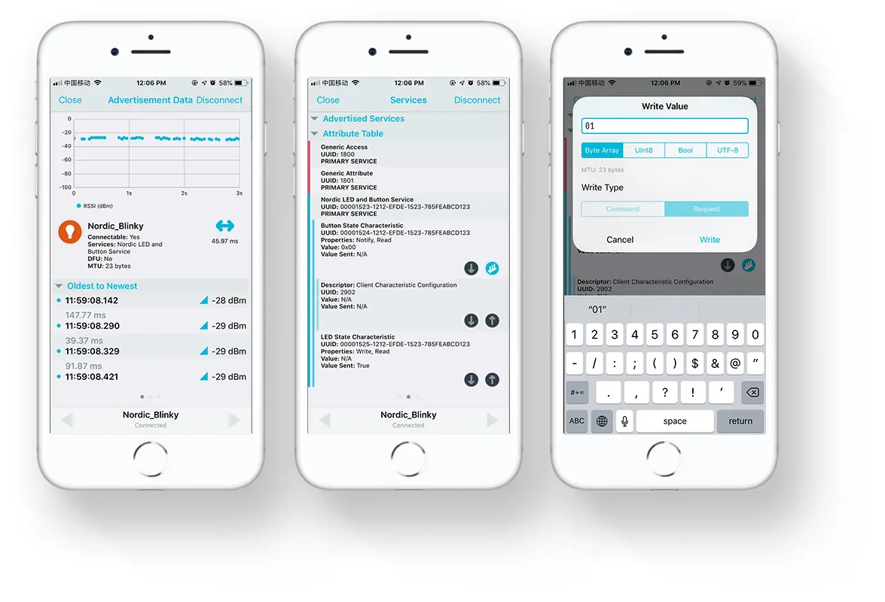

# BLE Blinky Example

## Description

The BLE Blinky Example uses the LED Button Service Server module. This module implements a custom LED Button Service with an LED and Button Characteristics that are used to toggle LEDs and receive button statuses from the nRF52840 M.2 module.

!!! Tip
	Before you start building, remember to set up the nRF5 SDK development environment first. See [Setup the nRF5 SDK](../setup.md) for details.

## Building the example

You can find the source code and the project file of the example in the following folder: [examples/nrf5-sdk/ble_app_blinky](https://github.com/makerdiary/nrf52840-m2-devkit/tree/master/examples/nrf5-sdk/ble_app_blinky).

Open terminal and navigate to the directory with the example Makefile:

``` sh
cd ./examples/nrf5-sdk/ble_app_blinky/armgcc
```

Run `make merge` to build the application and merge with the Softdevice:

``` sh
make merge
```

## Programming the firmware

If compiled successfully, the firmware is located in `ble_app_blinky/armgcc/_build` with the name `nrf52840_xxaa_s140.hex`.

Connect the debugger USB port to your PC using the provided USB-C Cable. A disk drive called **M2-DOCK** will be automatically detected by the computer.


Run the following command in `ble_app_blinky/armgcc` to program the board:

``` sh
make flash_all
```

!!! Tip
	See **[Programming](../../programming.md)** section for details about how to program the nRF52840 M.2 Module.

## Testing

You can test the example with the **nRF Connect for Mobile** app by performing the following steps:

1. Download the [nRF Connect for Mobile](https://www.nordicsemi.com/Software-and-tools/Development-Tools/nRF-Connect-for-mobile) from App Store or Google Play.

2. Connect to the device from nRF Connect (the device is advertising as **Nordic_Blinky**).

3. Observe the LEDs state. This indicates that the connections is established.

4. Observe that the *`Nordic LED and Button Service`* is shown in the connected device. It contains two characteristics: *`Button State Characteristic`* and *`LED State Characteristic`*.

5. Enable *`Notify`* on the *`Button State Characteristic`*. Notifications are received when pressing or releasing the USER Button.

6. Write `01` to the *`LED State Characteristic`* and observe that RED LED is turned on.

7. Write `00` to the *`LED State Characteristic`* and observe that RED LED is turned off.

[](assets/images/ble-app-blinky-example.webp)

## Create an Issue

Interested in contributing to this project? Want to report a bug? Feel free to click here:

<a href="https://github.com/makerdiary/nrf52840-m2-devkit/issues/new?title=nRF5%20SDK-BLE%20Blinky:%20%3Ctitle%3E"><button data-md-color-primary="red-bud"><i class="fa fa-github"></i> Create an Issue</button></a>

