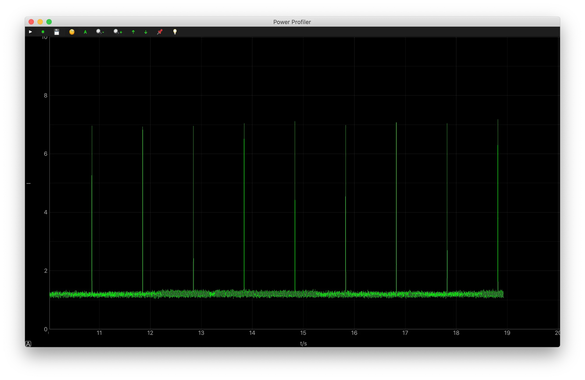
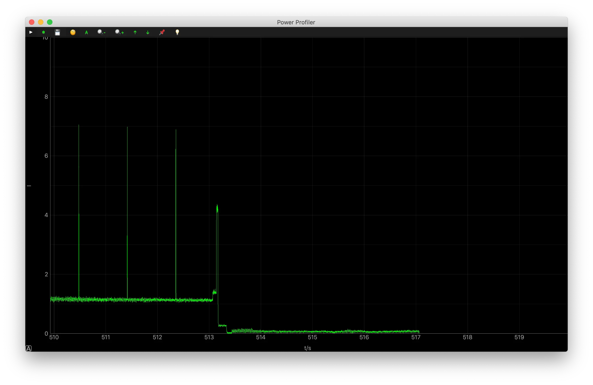

# Power Profiling Example

## Description

The Power Profiling Example demonstrates how to place the board into a minimum power consumption state and perform the real-time current profiling.

This example application starts up, sends the Deep Power-down (DP) instruction to the QSPI flash memory and puts the TFT LCD into sleep mode. 

When the USER button is pressed, the board enters the System OFF mode. The minimum current can be measured by the advanced power profiling module on M.2 Dock.

!!! Tip
	Before you start building, remember to set up the nRF5 SDK development environment first. See [Setup the nRF5 SDK](../setup.md) for details.


## Building the example

You can find the source code and the project file of the example in the following folder: [examples/nrf5-sdk/pwr_mgmt](https://github.com/makerdiary/nrf52840-m2-devkit/tree/master/examples/nrf5-sdk/pwr_mgmt).

Open terminal and navigate to the directory with the example Makefile:

``` sh
cd ./examples/nrf5-sdk/pwr_mgmt/armgcc
```

Run `make` to build the example:

``` sh
make
```

## Programming the firmware

If compiled successfully, the firmware is located in `pwr_mgmt/armgcc/_build` with the name `nrf52840_xxaa.hex`.

Connect the debugger USB port to your PC using the provided USB-C Cable. A disk drive called **M2-DOCK** will be automatically detected by the computer.


Run the following command in `pwr_mgmt/armgcc` to program the board:

``` sh
make flash_all
```

!!! Tip
	See **[Programming](../../programming.md)** section for details about how to program the nRF52840 M.2 Module.

## Testing

To measure the appplication current by performing the following steps:

1. Open the terminal and install Power Profiler utility. **Skip** this step if Power Profiler already exists.

	``` sh
	pip3 install power-profiler
	```

2. Connect the debugger USB port to your PC. When the **M2-DOCK** drive appears, start the Power Profiler in the terminal:

	``` sh
	power-profiler
	```

3. The Power Profiler window will appear. Observe the current curve in the normal mode:

	

5. Press the USER button to enter the System OFF mode. Observe that the current curve is sloping down:

	


!!! Tip
	See **[Power Profiling](../../power-profiling.md)** section for details about how to perform the real-time current profiling.

## Create an Issue

Interested in contributing to this project? Want to report a bug? Feel free to click here:

<a href="https://github.com/makerdiary/nrf52840-m2-devkit/issues/new?title=nRF5%20SDK-Power%20Profiling:%20%3Ctitle%3E"><button class="md-tile md-tile--primary"><svg xmlns="http://www.w3.org/2000/svg" viewBox="0 0 14 16" width="14" height="16"><path fill-rule="evenodd" d="M7 2.3c3.14 0 5.7 2.56 5.7 5.7s-2.56 5.7-5.7 5.7A5.71 5.71 0 011.3 8c0-3.14 2.56-5.7 5.7-5.7zM7 1C3.14 1 0 4.14 0 8s3.14 7 7 7 7-3.14 7-7-3.14-7-7-7zm1 3H6v5h2V4zm0 6H6v2h2v-2z"></path></svg> Create an Issue</button></a>