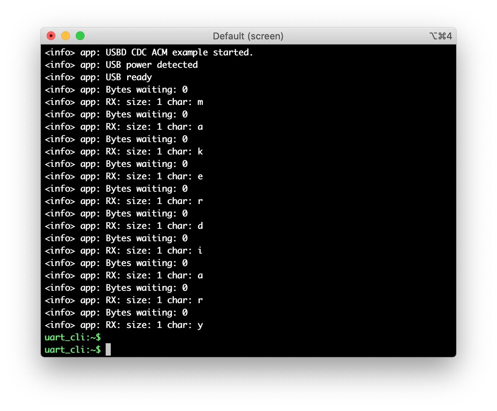
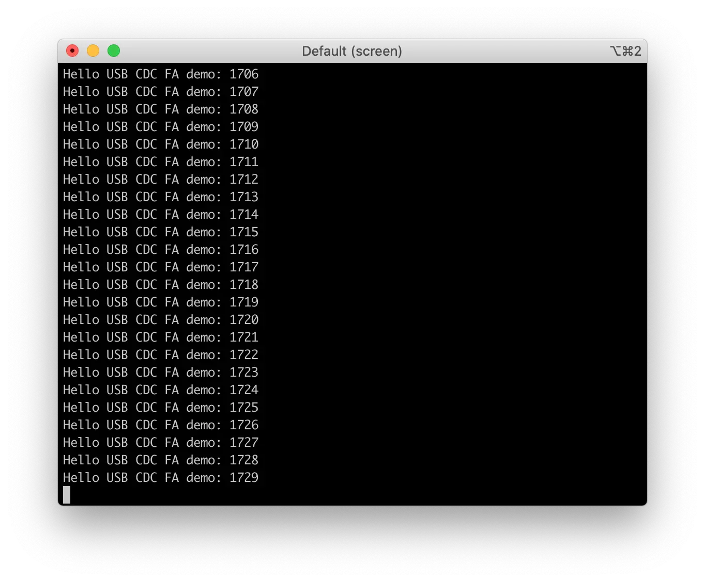

# USB CDC ACM Example

## Description

This example demonstrates use of the USB Communication Device Class (CDC) Abstract Control Model (ACM) driver, commonly known as Virtual COM port. After connecting the nRF52840 M.2 USB, the module will enumerate as a `COMx` port on Windows hosts or as a `/dev/ttyACMx` device on Linux/Unix hosts. The port can be opened and closed just like a traditional serial port.

!!! Tip
	Before you start building, remember to set up the nRF5 SDK development environment first. See [Setup the nRF5 SDK](../setup.md) for details.

## Building the example

You can find the source code and the project file of the example in the following folder: [examples/nrf5-sdk/usb_cdc_acm](https://github.com/makerdiary/nrf52840-m2-devkit/tree/master/examples/nrf5-sdk/usb_cdc_acm).

Open terminal and navigate to the directory with the example Makefile:

``` sh
cd ./examples/nrf5-sdk/usb_cdc_acm/armgcc
```

Run `make` to build the example:

``` sh
make
```

## Programming the firmware

If compiled successfully, the firmware is located in `usb_cdc_acm/armgcc/_build` with the name `nrf52840_xxaa.hex`.

Connect the debugger USB port to your PC using the provided USB-C Cable. A disk drive called **M2-DOCK** will be automatically detected by the computer.


Run the following command in `usb_cdc_acm/armgcc` to program the board:

``` sh
make flash_all
```

!!! Tip
	See **[Programming](../../programming.md)** section for details about how to program the nRF52840 M.2 Module.

## Testing

Test the USB CDC ACM Example application by performing the following steps:

1. Run a terminal application like [PuTTY](https://www.chiark.greenend.org.uk/~sgtatham/putty/) or [screen](https://www.gnu.org/software/screen/manual/screen.html) to open the debugger's virtual com port for logging:

	``` sh
	screen /dev/cu.usbmodem14102 115200
	```

2. Connect the nRF52840 M.2 USB port using another USB cable, and run another terminal to open the USB CDC ACM port:

	``` sh
	screen /dev/cu.usbmodemF09F05D94F451 115200
	```

3. Send test data from the second terminal to the module. Observe that the RED LED will blink and the debugger COM port will print the test data:

	

4. Press USER Button. A test frame will be sent from the module. BLUE LED state will change. The transmitted data will display on the second terminal window as well.

	

!!! Note
	Windows 8 (and later) hosts will pick the correct driver (`usbser.sys`) automatically. If you are running Windows 7, the [USB CDC ACM driver](https://github.com/makerdiary/nrf52840-m2-devkit/tree/master/usb_drivers) should be installed manually.

## Create an Issue

Interested in contributing to this project? Want to report a bug? Feel free to click here:

<a href="https://github.com/makerdiary/nrf52840-m2-devkit/issues/new?title=nRF5%20SDK-USB%20CDC%20ACM:%20%3Ctitle%3E"><button data-md-color-primary="red-bud"><i class="fa fa-github"></i> Create an Issue</button></a>

