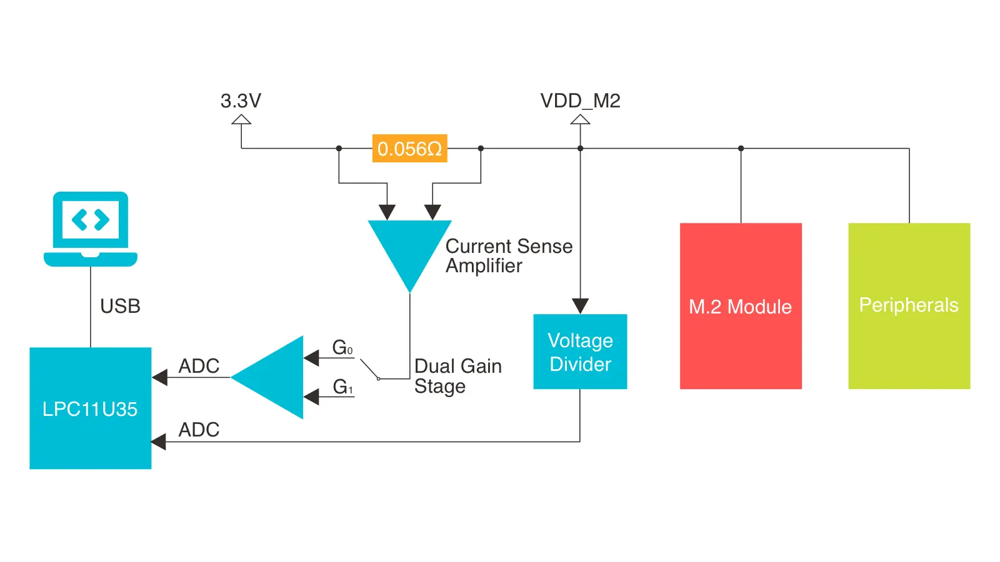
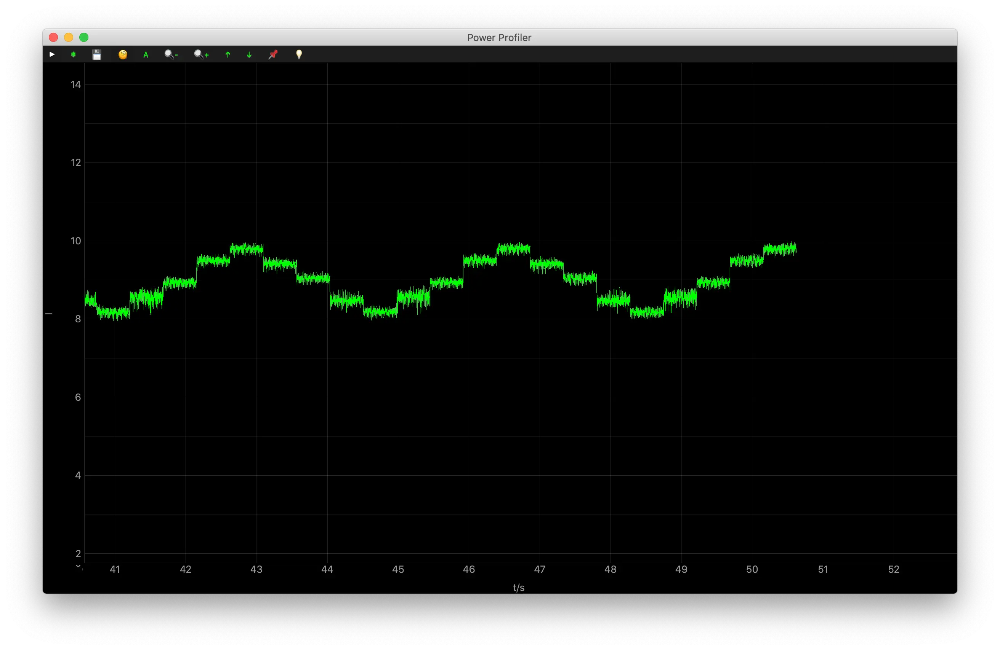

# Getting Started with Power Profiling

## Description

The [M.2 Dock](../../m2-dock) features an Advanced Power Profiler, enabling you to perform real-time current profiling of your applications without using external tools.

**Key features**

* Up to 690 mA current measurement
* Voltage tracking
* 30000 samples per second
* Precision amplifiers with dual gain stage
* Cross-platform utility available in Python

This section details how to perform real-time current profiling of your applications.

## How it works

The Advanced Power Profiler utilizes a current sense amplifier together with a dual gain stage to measure the voltage drop over a small series resistor (0.056Ω). The output voltage is measured by an ADC channel.

The Advanced Power Profiler is capable of measuring currents up to 690 mA. When measuring currents below 11 mA, the accuracy is 50 µA. For currents above 11 mA, the accuracy is 5 mA.

In addition, the voltage of the module (VDD_M2) is measured by another ADC channel through a 1:2 voltage divider. 

After the conversion is completed, the samples are exported to the Power Profiler utility over USB CDC ACM. It can produce 30000 samples per second (2 bytes per sample).

The figure below shows how the Advanced Power Profiler works:



## Installing the Power Profiler

[Power Profiler](https://github.com/makerdiary/power-profiler) is an open source Python utility for real-time power profiling of your applications running on the nRF52840 M.2 Developer Kit. It is fully cross-platform, with support for Linux, macOS, and Windows.

The latest stable version of Power Profiler can be installed via [pip](https://pip.pypa.io/en/stable/index.html) as follows.

``` sh
pip3 install power-profiler
```

## Using the Power Profiler

The steps below demonstrate how to use the Power Profiler utility to perform real-time current profiling of a simple application:

1. Assemble the M.2 Module, then connect the **Debugger USB port** to your PC using the provided USB-C Cable. A disk drive called **M2-DOCK** will be automatically detected by the computer.

	

2. Program the board with your application firmware. Will use the [Blinky](../nrf5-sdk/examples/blinky) example here to keep it simple.

3. Start the Power Profiler in your terminal by running:

	``` sh
	power-profiler
	```

4. The Power Profiler window will appear. Observe the current curve:

	

5. You can try more example applications and measure their real-time power consumption.


## Create an Issue

Interested in contributing to this project? Want to report a bug? Feel free to click here:

<a href="https://github.com/makerdiary/nrf52840-m2-devkit/issues/new?title=Power%20Profiling:%20%3Ctitle%3E"><button class="md-tile md-tile--primary"><svg xmlns="http://www.w3.org/2000/svg" viewBox="0 0 14 16" width="14" height="16"><path fill-rule="evenodd" d="M7 2.3c3.14 0 5.7 2.56 5.7 5.7s-2.56 5.7-5.7 5.7A5.71 5.71 0 011.3 8c0-3.14 2.56-5.7 5.7-5.7zM7 1C3.14 1 0 4.14 0 8s3.14 7 7 7 7-3.14 7-7-3.14-7-7-7zm1 3H6v5h2V4zm0 6H6v2h2v-2z"></path></svg> Create an Issue</button></a>
