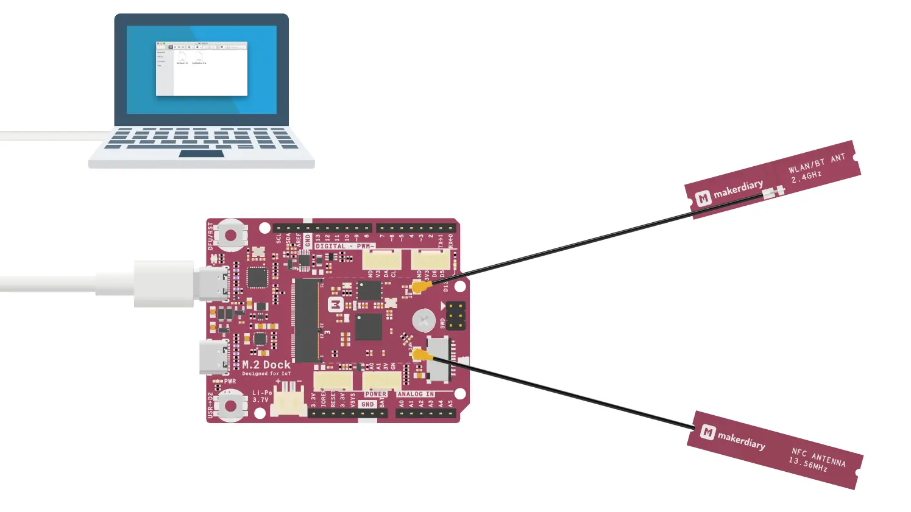
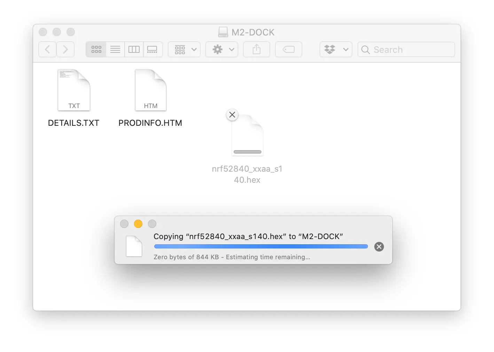

# How to Program the nRF52840 M.2 Module

## Description

The [M.2 Dock](https://wiki.makerdiary.com/m2-dock) included in the Developer Kit features a fully-integrated DAPLink debugger, which enables you to program and debug the nRF52840 M.2 Module. 

This section describes how to program the nRF52840 M.2 Module using the M.2 Dock. You have the following two options to program your module:

* [Drag-n-Drop Programming](#drag-n-drop-programming)
* [Using pyOCD Command Tool](#using-pyocd-command-tool)

## Prepare for Programming

1. Mount the nRF52840 M.2 Module
2. Connect the **Debugger USB port** to your PC using the provided USB-C Cable
3. A disk drive called **M2-DOCK** will be automatically detected by the computer.



## Drag-n-Drop Programming

Drag-n-Drop is an optional intuitive programming feature. It allows programming of your target MCU in a very simple way: dragging and dropping a file (`.hex`-format) onto the **M2-DOCK** drive.

There is no need to install application software. Anyone that can drag and drop a file to a USB memory stick can now program the target module.



!!! tip
	Upon completion, the drive remounts. If a failure occurs, the file `FAIL.TXT` appears on the drive containing information about the failure.

## Using pyOCD Command Tool

[pyOCD](https://github.com/mbedmicro/pyOCD) is an open source Python package for programming and debugging Arm Cortex-M microcontrollers using the DAPLink debugger. It is fully cross-platform, with support for Linux, macOS, and Windows.

The latest stable version of pyOCD can be installed via [pip](https://pip.pypa.io/en/stable/index.html) as follows. **Skip** the installation if pyOCD already exists.

``` sh
pip install -U pyocd
```

List information about the probe connected to your computer by running:

``` sh
pyocd list
```

The output should be similar as below:

``` sh
  #   Probe                   Unique ID
--------------------------------------------------------------------------------
  0   ARM DAPLink CMSIS-DAP   10283602185129a100000000000000000000000097969902
```

The following commands demonstrate how to flash/erase the nRF52840 M.2 Module:

* To erase the whole flash of the nRF52840 target:

	``` sh
	pyocd erase -t nrf52840 --chip
	```

* To flash the nRF52840 target with `.hex`-format firmware:

	``` sh
	pyocd flash -t nrf52840 Sample.hex
	```

* To flash the nRF52840 target with a plain binary:

	``` sh
	pyocd flash -t nrf52840 --base-address 0x1000 Sample.bin
	```
	The `--base-address` option is used for setting the address where to flash a binary. Defaults to start of flash.


!!! tip
	Run `pyocd --hlep` to get the available commands and additional help.

## Reference

* [M.2 Dock User's Guide](https://wiki.makerdiary.com/m2-dock)
* [pyOCD Documentation](https://github.com/mbedmicro/pyOCD/tree/master/docs)

## Create an Issue

Interested in contributing to this project? Want to report a bug? Feel free to click here:

<a href="https://github.com/makerdiary/nrf52840-m2-devkit/issues/new?title=Programming:%20%3Ctitle%3E"><button class="md-tile md-tile--primary"><svg xmlns="http://www.w3.org/2000/svg" viewBox="0 0 14 16" width="14" height="16"><path fill-rule="evenodd" d="M7 2.3c3.14 0 5.7 2.56 5.7 5.7s-2.56 5.7-5.7 5.7A5.71 5.71 0 011.3 8c0-3.14 2.56-5.7 5.7-5.7zM7 1C3.14 1 0 4.14 0 8s3.14 7 7 7 7-3.14 7-7-3.14-7-7-7zm1 3H6v5h2V4zm0 6H6v2h2v-2z"></path></svg> Create an Issue</button></a>
