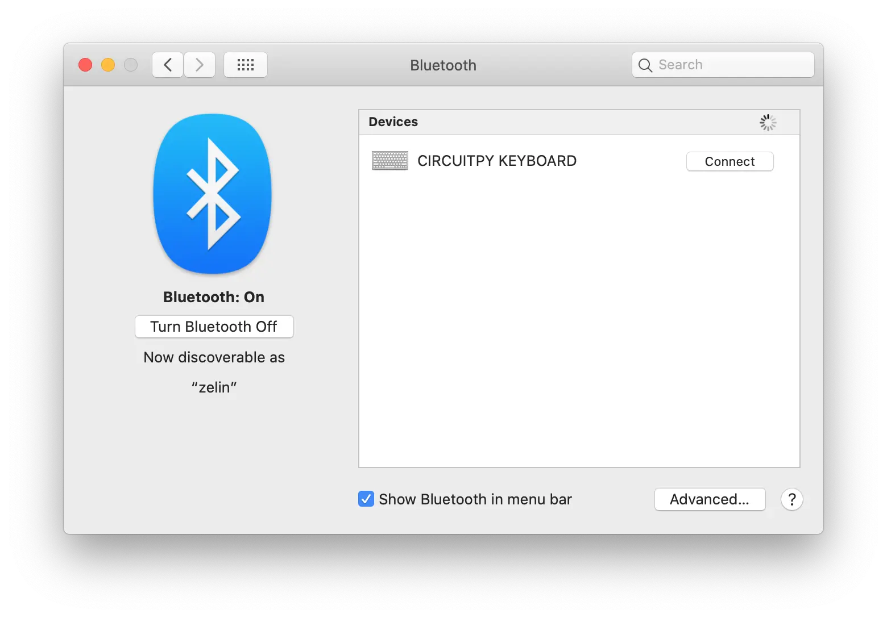

# Bluetooth HID Keyboard Example

## Description

The Bluetooth HID Keyboard Example demonstrates how to use the Bluetooth Low Energy HID GATT Service for a keyboard.

The example code enumerates the nRF52840 M.2 Developer Kit into a Bluetooth HID keyboard that has an <kbd>A</kbd> key pressed by the USER button. The code depends on:

* [adafruit_ble driver](https://github.com/adafruit/Adafruit_CircuitPython_BLE)
* [adafruit_hid driver](https://github.com/adafruit/Adafruit_CircuitPython_HID)

Before you start coding, the Python Interpreter should be installed on the nRF52840 M.2 module correctly:

<a href="../../install"><button class="md-issue-button md-issue-button--primary" style="width:auto;">Install Python Interpreter</button></a>

## Run the code

Run the USB HID Keyboard Example by performing the following steps:

1. Connect the **Module USB port** to your PC as shown in the figure below. A disk drive called **CIRCUITPY** should be automatically detected by the computer:

	

2. The example code depends on the [adafruit_ble](https://github.com/adafruit/Adafruit_CircuitPython_BLE) and [adafruit_hid](https://github.com/adafruit/Adafruit_CircuitPython_HID) drivers. Download and extract them into your **`CIRCUITPY/lib`** folder. This should give you the following folder structure:

	``` sh
	CIRCUITPY
	├── boot_out.txt
	├── code.py
	└── lib
		├── adafruit_ble
		└── adafruit_hid

	```

3. Open the `code.py` file on your **CIRCUITPY** drive, then copy and paste the following code:

	``` py
	import time
	import board
	import digitalio
	import adafruit_ble
	from adafruit_ble.advertising import Advertisement
	from adafruit_ble.advertising.standard import ProvideServicesAdvertisement
	from adafruit_ble.services.standard.hid import HIDService
	from adafruit_hid.keyboard import Keyboard
	from adafruit_hid.keycode import Keycode

	hid = HIDService()
	advertisement = ProvideServicesAdvertisement(hid)
	advertisement.complete_name = 'CIRCUITPY KEYBOARD'
	advertisement.appearance = 961
	ble = adafruit_ble.BLERadio()
	if ble.connected:
		for c in ble.connections:
			c.disconnect()
	ble.start_advertising(advertisement)
	advertising = True
	ble_keyboard = Keyboard(hid.devices)

	button = digitalio.DigitalInOut(board.USR_BTN)
	button.direction = digitalio.Direction.INPUT
	button.pull = digitalio.Pull.UP

	last_value = button.value

	while True:
		if last_value != button.value:
			last_value = button.value
			print('Button is ' + ('released' if button.value else 'pressed'))
			if ble.connected:
				if not button.value:
					ble_keyboard.press(Keycode.A)
				else:
					ble_keyboard.release(Keycode.A)

	```

4. Your code will run as soon as the file is done saving. A Bluetooth keyboard with the name `CIRCUITPY KEYBOARD` can be discovered by the host. Connect to the keyboard.

	

5. Press the USER button and observe that a letter **`a`** will be sent to the host computer.

## Reference

* [Adafruit_CircuitPython_BLE Repository](https://github.com/adafruit/Adafruit_CircuitPython_BLE)
* [Adafruit_CircuitPython_HID Repository](https://github.com/adafruit/Adafruit_CircuitPython_HID)

## Create an Issue

Interested in contributing to this project? Want to report a bug? Feel free to click here:

<a href="https://github.com/makerdiary/nrf52840-m2-devkit/issues/new?title=Python:%20BLE%20Keyboard:%20%3Ctitle%3E"><button class="md-issue-button md-issue-button--primary"><svg xmlns="http://www.w3.org/2000/svg" viewBox="0 0 14 16" width="14" height="16"><path fill-rule="evenodd" d="M7 2.3c3.14 0 5.7 2.56 5.7 5.7s-2.56 5.7-5.7 5.7A5.71 5.71 0 011.3 8c0-3.14 2.56-5.7 5.7-5.7zM7 1C3.14 1 0 4.14 0 8s3.14 7 7 7 7-3.14 7-7-3.14-7-7-7zm1 3H6v5h2V4zm0 6H6v2h2v-2z"></path></svg> Create an Issue</button></a>
