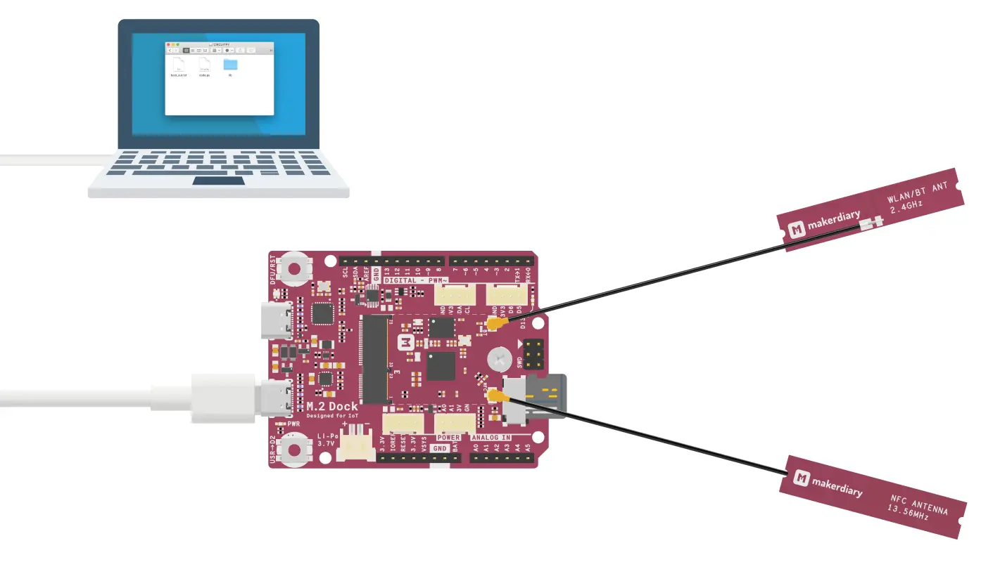
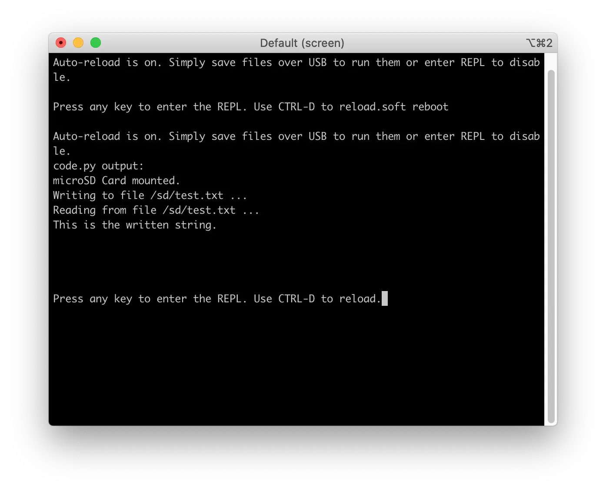

# microSD Card Example

## Description

The microSD Card Example demonstrates the use of a microSD memory card using the SD Card library and the FatFs file system library.

The example initializes the card and performs basic operations like mounting the FAT volume, writing and reading the example file.

The microSD Card is connected over a SPI bus. The table below shows the connections of each pin of the microSD Card:

| microSD Card Pin      | nRF52840 Pin  |
|-----------------------|---------------|
| nCS                   | P0_07         |
| SCLK                  | P0_11         |
| MOSI                  | P0_12         |
| MISO                  | P1_08         |

Before you start coding, the Python Interpreter should be installed on the nRF52840 M.2 module correctly:

<a href="../../install"><button class="md-issue-button md-issue-button--primary" style="width:auto;">Install Python Interpreter</button></a>

## Run the code

Run the microSD Card Example by performing the following steps:

1. Power down the board

2. Insert a **FAT formatted** microSD card into the microSD slot

3. Connect the **Module USB port** to your PC as shown in the figure below. A disk drive called **CIRCUITPY** should be automatically detected by the computer:

	

4. Open the `code.py` file on your **CIRCUITPY** drive, then copy and paste the following code. Your code will run as soon as the file is done saving.

	``` py
	# SD card usage
	import board
	import digitalio
	import sdcard
	import storage

	spi = board.SPI()
	cs = digitalio.DigitalInOut(board.P7)
	sd = sdcard.SDCard(spi, cs)
	vfs = storage.VfsFat(sd)
	storage.mount(vfs, "/sd")
	print("microSD Card mounted.")

	# write to sd card
	print("Writing to file /sd/test.txt ...")
	with open("/sd/test.txt", "w") as f:
		f.write("This is the written string.\n")

	# read from sd card
	print("Reading from file /sd/test.txt ...")
	with open("/sd/test.txt", "r") as f:
		data = f.read()
		print(data)

	```

5. Run a terminal application like [PuTTY](https://www.chiark.greenend.org.uk/~sgtatham/putty/) or [screen](https://www.gnu.org/software/screen/manual/screen.html):

	``` sh
	screen /dev/cu.usbmodem14102 115200
	```

6. Save the code and observe the output of the terminal:

	

## Create an Issue

Interested in contributing to this project? Want to report a bug? Feel free to click here:

<a href="https://github.com/makerdiary/nrf52840-m2-devkit/issues/new?title=Python:%20microSD Card:%20%3Ctitle%3E"><button class="md-issue-button md-issue-button--primary"><svg xmlns="http://www.w3.org/2000/svg" viewBox="0 0 14 16" width="14" height="16"><path fill-rule="evenodd" d="M7 2.3c3.14 0 5.7 2.56 5.7 5.7s-2.56 5.7-5.7 5.7A5.71 5.71 0 011.3 8c0-3.14 2.56-5.7 5.7-5.7zM7 1C3.14 1 0 4.14 0 8s3.14 7 7 7 7-3.14 7-7-3.14-7-7-7zm1 3H6v5h2V4zm0 6H6v2h2v-2z"></path></svg> Create an Issue</button></a>
