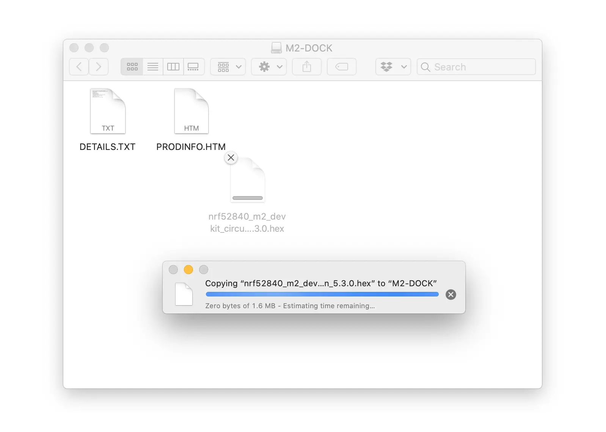

# Install Python Interpreter

This section describes how to install and verify the Python Interpreter on your nRF52840 M.2 Developer Kit.

## Prepare the firmware

The pre-built CircuitPython firmware for the nRF52840 M.2 Developer Kit is a `.hex` file. Download it into your local directory:

<a href="https://github.com/makerdiary/nrf52840-m2-devkit/tree/master/firmware/python/nrf52840_m2_devkit_circuitpython_5.3.0.hex"><button class="md-tile md-tile--primary" style="width:auto;"><svg xmlns="http://www.w3.org/2000/svg" viewBox="0 0 16 16" width="16" height="16"><path fill-rule="evenodd" d="M9 12h2l-3 3-3-3h2V7h2v5zm3-8c0-.44-.91-3-4.5-3C5.08 1 3 2.92 3 5 1.02 5 0 6.52 0 8c0 1.53 1 3 3 3h3V9.7H3C1.38 9.7 1.3 8.28 1.3 8c0-.17.05-1.7 1.7-1.7h1.3V5c0-1.39 1.56-2.7 3.2-2.7 2.55 0 3.13 1.55 3.2 1.8v1.2H12c.81 0 2.7.22 2.7 2.2 0 2.09-2.25 2.2-2.7 2.2h-2V11h2c2.08 0 4-1.16 4-3.5C16 5.06 14.08 4 12 4z"></path></svg> CircuitPython 5.3.0</button></a>

## Install Python

Install the Python Interpreter by performing the following steps:

1. Connect the **Debugger USB port** to your PC using the provided USB-C Cable. A disk drive called **M2-DOCK** will be automatically detected by the computer:

	

2. Drag and drop the firmware `nrf52840_m2_devkit_circuitpython_5.3.0.hex` onto the **M2-DOCK** drive:

	

3. Alternatively, you can run the following command to flash the firmware:

	``` sh
	pyocd flash -t nrf52840 nrf52840_m2_devkit_circuitpython_5.3.0.hex
	```

!!! Tip
	See **[Programming](../programming.md)** section for more details about how to program the nRF52840 M.2 Module.

## Verify the firmware

Once the Python Interpreter firmware is flashed, we can verify it by performing the following steps:

1. Connect the **Module USB port** to your PC as shown in the figure below. A disk drive called **CIRCUITPY** should be automatically detected by the computer:

	

2. Start a terminal application like [PuTTY](https://www.chiark.greenend.org.uk/~sgtatham/putty/) or [screen](https://www.gnu.org/software/screen/manual/screen.html):

	``` sh
	screen /dev/cu.usbmodem14102 115200
	```

3. In the terminal window, press any key to enter the Python REPL mode, and try some Python code:

	``` py
	>>> print('Hello, world!')
	```

	

## Next Steps

Now that you have the Python Interpreter installed, it's time to explore more examples for the nRF52840 M.2 Developer Kit:

* [Blinky](examples/blinky.md)
* [Button](examples/button.md)
* [microSD Card](examples/microsd.md)
* [TFT LCD Display](examples/lcd.md)
* [USB HID Keyboard](examples/usb-keyboard.md)
* [BLE HID Keyboard](examples/ble-keyboard.md)

## Create an Issue

Interested in contributing to this project? Want to report a bug? Feel free to click here:

<a href="https://github.com/makerdiary/nrf52840-m2-devkit/issues/new?title=Install%20Python:%20%3Ctitle%3E"><button class="md-tile md-tile--primary"><svg xmlns="http://www.w3.org/2000/svg" viewBox="0 0 14 16" width="14" height="16"><path fill-rule="evenodd" d="M7 2.3c3.14 0 5.7 2.56 5.7 5.7s-2.56 5.7-5.7 5.7A5.71 5.71 0 011.3 8c0-3.14 2.56-5.7 5.7-5.7zM7 1C3.14 1 0 4.14 0 8s3.14 7 7 7 7-3.14 7-7-3.14-7-7-7zm1 3H6v5h2V4zm0 6H6v2h2v-2z"></path></svg> Create an Issue</button></a>