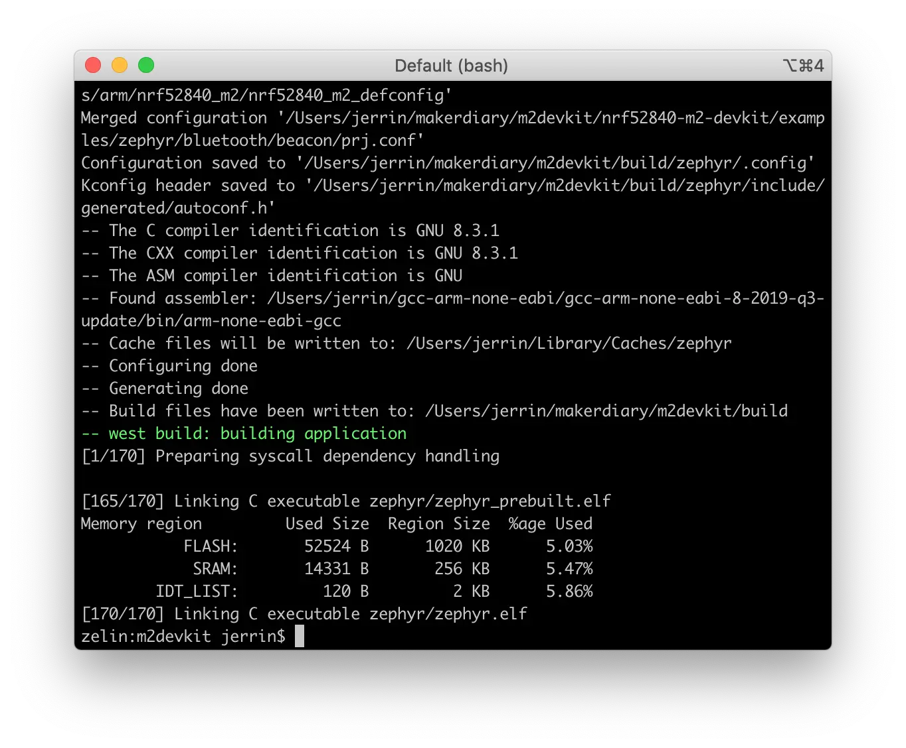
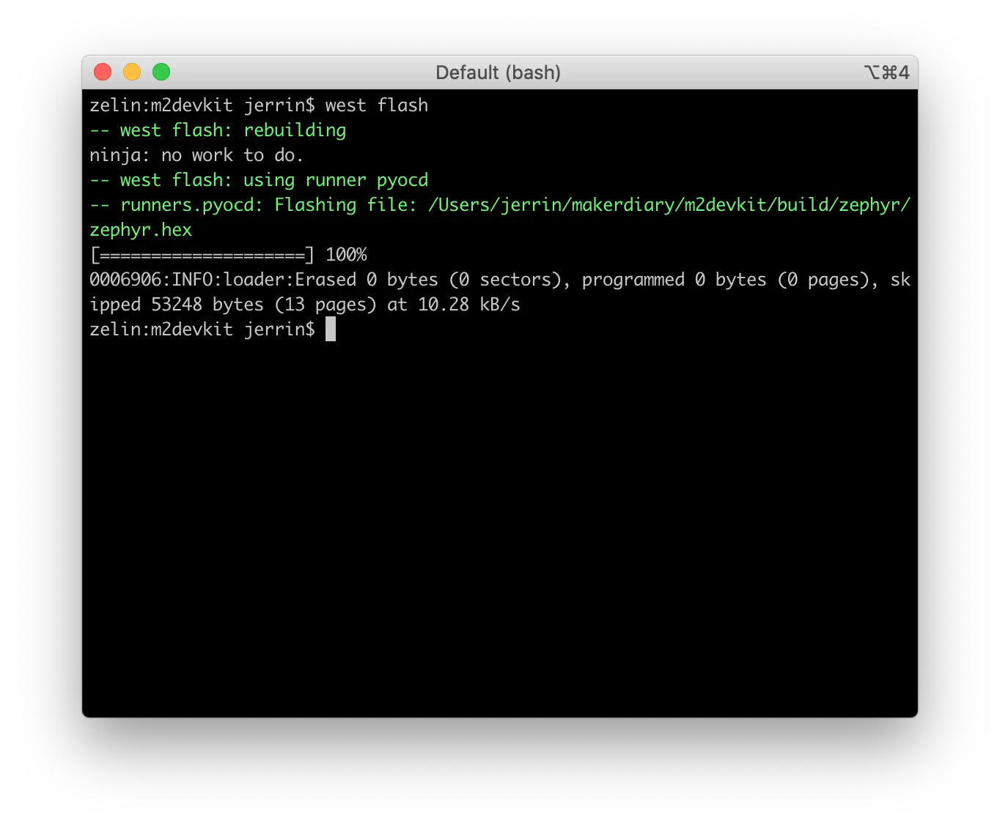
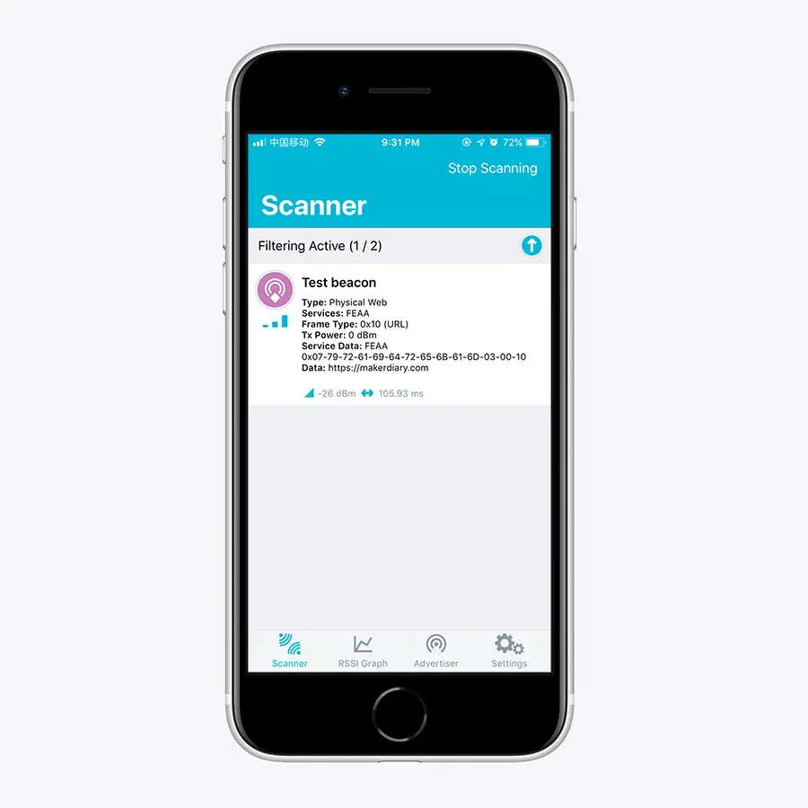

# Bluetooth: Beacon Example

The Bluetooth Beacon Example demonstrates the BLE Broadcaster role functionality by advertising an Eddystone URL.

Before you start building, the Zephyr development environment should be set up correctly:

<a href="../../setup"><button data-md-color-primary="red-bud" style="width:auto;">Setup Zephyr Toolchain</button></a>

## Build the example

You can find the source code and the project file of the example in the following folder: [examples/zephyr/bluetooth/beacon](https://github.com/makerdiary/nrf52840-m2-devkit/tree/master/examples/zephyr/bluetooth/beacon).

Build the example by performing the following steps:

1. Open terminal and navigate to the `m2devkit` directory created in the [Setup the toolchain](../setup.md) section:

	``` sh
	cd <sourcecode_root>/m2devkit
	```

2. Use `west` to build the example:

	``` sh
	west build -b nrf52840_m2 nrf52840-m2-devkit/examples/zephyr/bluetooth/beacon
	```
	
	

!!! tip
	If a build system is present, make the build folder pristine before building:

	``` sh
	west build -t pristine
	```

## Flash the example

After compiled successfully, the firmware is located in `m2devkit/build/zephyr` with the name `zephyr.hex`.

Connect the debugger USB port to your PC using the provided USB-C Cable. A disk drive called **M2-DOCK** will be automatically detected by the computer.


Run the following command to flash the board:

``` sh
west flash
```



## Testing

Test the Bluetooth Beacon Example application by performing the following steps:

1. Connect the debugger USB port to your PC

2. Run a terminal application like [PuTTY](https://www.chiark.greenend.org.uk/~sgtatham/putty/) or [screen](https://www.gnu.org/software/screen/manual/screen.html):

	``` sh
	screen /dev/cu.usbmodem14102 115200
	```

3. Press RESET button, and observe the output of the terminal:

	``` sh
	*** Booting Zephyr OS build zephyr-v2.2.0-727-gfc407574412a  ***
	Starting Beacon Demo
	Bluetooth initialized
	Beacon started
	[00:00:00.007,568] <inf> bt_hci_core: HW Platform: Nordic Semiconductor (0x0002)
	[00:00:00.007,568] <inf> bt_hci_core: HW Variant: nRF52x (0x0002)
	[00:00:00.007,568] <inf> bt_hci_core: Firmware: Standard Bluetooth controller (0x00) Version 2.2 Build 99
	[00:00:00.008,117] <inf> bt_hci_core: Identity: f0:9f:05:d9:4f:45 (random)
	[00:00:00.008,148] <inf> bt_hci_core: HCI: version 5.1 (0x0a) revision 0x0000, manufacturer 0x05f1
	[00:00:00.008,148] <inf> bt_hci_core: LMP: version 5.1 (0x0a) subver 0xffff
	```

4. Start the [nRF Connect for Mobile](https://www.nordicsemi.com/Software-and-tools/Development-Tools/nRF-Connect-for-mobile) app, scan the device and observe that the beacon is advertising an Eddystone URL ([https://makerdiary.com](https://makerdiary.com)) with the Device Name **Test beacon**.

	[](assets/images/nrf-connect-ble-beacon.webp)

## Create an Issue

Interested in contributing to this project? Want to report a bug? Feel free to click here:

<a href="https://github.com/makerdiary/nrf52840-m2-devkit/issues/new?title=Zephyr:%20BLE%20Beacon:%20%3Ctitle%3E"><button data-md-color-primary="red-bud"><i class="fa fa-github"></i> Create an Issue</button></a>
