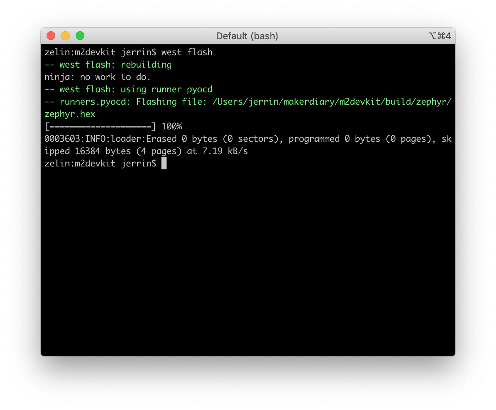
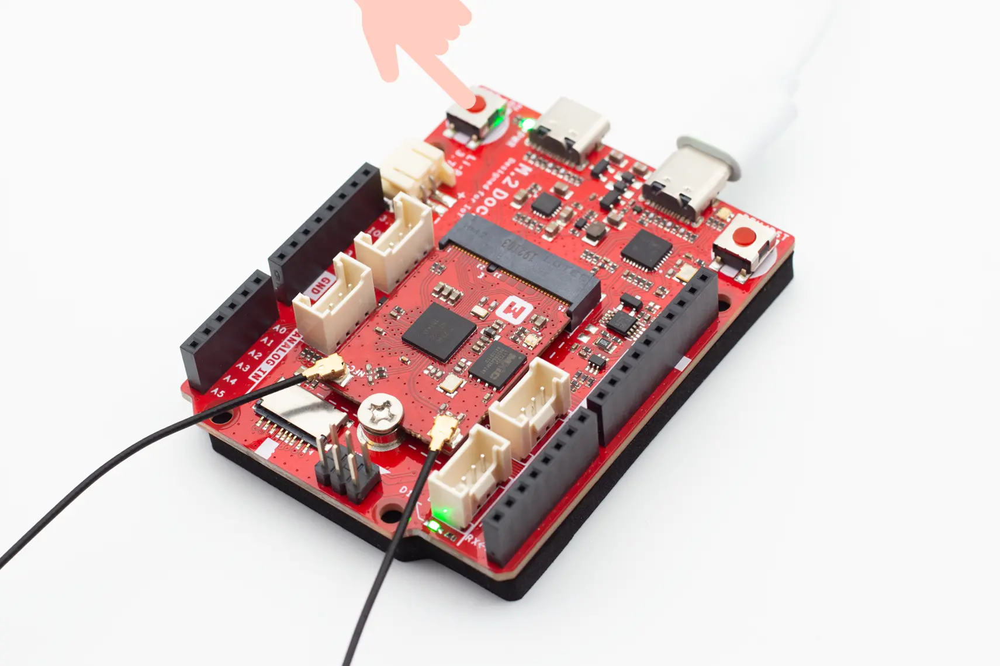
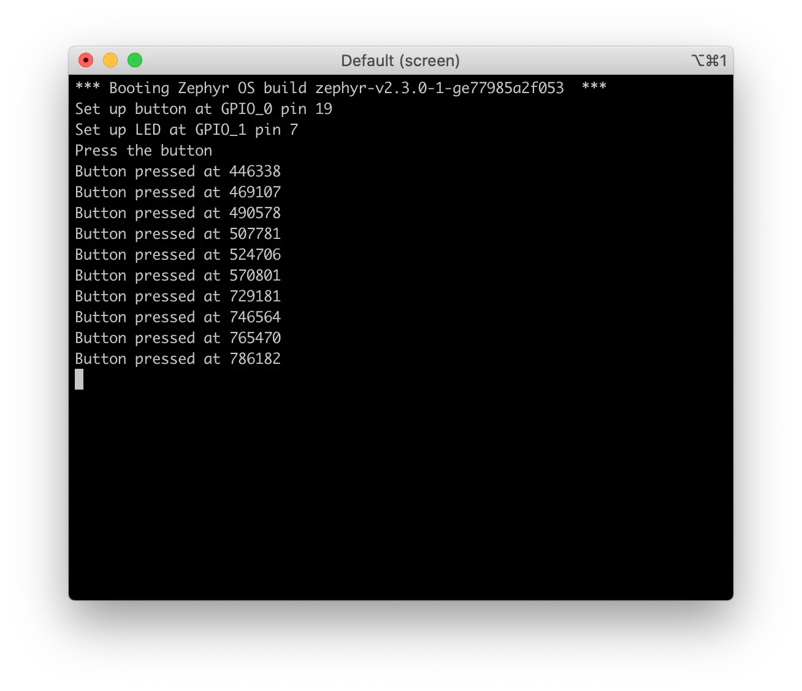

# Button Example

The Button Example demonstrates the use of GPIO input with interrupts. The example prints a message to the console each time a button is pressed. An optional `led0` devicetree alias is supported additionally. The LED will be turned on when the button is pressed, and turned off when it is released.

Before you start building, the Zephyr development environment should be set up correctly:

<a href="../../setup"><button class="md-tile md-tile--primary" style="width:auto;"><svg xmlns="http://www.w3.org/2000/svg" viewBox="0 0 16 16" width="16" height="16"><path fill-rule="evenodd" d="M16 8.5l-6 6-3-3L8.5 10l1.5 1.5L14.5 7 16 8.5zM5.7 12.2l.8.8H2c-.55 0-1-.45-1-1V3c0-.55.45-1 1-1h7c.55 0 1 .45 1 1v6.5l-.8-.8c-.39-.39-1.03-.39-1.42 0L5.7 10.8a.996.996 0 000 1.41v-.01zM4 4h5V3H4v1zm0 2h5V5H4v1zm0 2h3V7H4v1zM3 9H2v1h1V9zm0-2H2v1h1V7zm0-2H2v1h1V5zm0-2H2v1h1V3z"></path></svg> Setup Zephyr Toolchain</button></a>

## Build the example

You can find the source code and the project file of the example in the following folder: [examples/zephyr/button](https://github.com/makerdiary/nrf52840-m2-devkit/tree/master/examples/zephyr/button).

Build the example by performing the following steps:

1. Open terminal and navigate to the `m2devkit` directory created in the [Setup the toolchain](../setup.md) section:

	``` sh
	cd <sourcecode_root>/m2devkit
	```

2. Use `west` to build the example:

	``` sh
	west build -b nrf52840_m2 nrf52840-m2-devkit/examples/zephyr/button
	```
	
	

!!! tip
	If a build system is present, make the build folder pristine before building:

	``` sh
	west build -t pristine
	```

## Flash the example

After compiled successfully, the firmware is located in `m2devkit/build/zephyr` with the name `zephyr.hex`.

Connect the debugger USB port to your PC using the provided USB-C Cable. A disk drive called **M2-DOCK** will be automatically detected by the computer.


Run the following command to flash the board:

``` sh
west flash
```



## Testing

Test the Button Example application by performing the following steps:

1. Run a terminal application like [PuTTY](https://www.chiark.greenend.org.uk/~sgtatham/putty/) or [screen](https://www.gnu.org/software/screen/manual/screen.html):

	``` sh
	screen /dev/cu.usbmodem14102 115200
	```

2. Press the USER button, then observe the GREEN LED and the output of the terminal.

	

	


## Create an Issue

Interested in contributing to this project? Want to report a bug? Feel free to click here:

<a href="https://github.com/makerdiary/nrf52840-m2-devkit/issues/new?title=Zephyr:%20Button:%20%3Ctitle%3E"><button class="md-tile md-tile--primary"><svg xmlns="http://www.w3.org/2000/svg" viewBox="0 0 14 16" width="14" height="16"><path fill-rule="evenodd" d="M7 2.3c3.14 0 5.7 2.56 5.7 5.7s-2.56 5.7-5.7 5.7A5.71 5.71 0 011.3 8c0-3.14 2.56-5.7 5.7-5.7zM7 1C3.14 1 0 4.14 0 8s3.14 7 7 7 7-3.14 7-7-3.14-7-7-7zm1 3H6v5h2V4zm0 6H6v2h2v-2z"></path></svg> Create an Issue</button></a>
